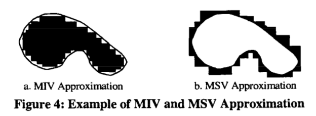
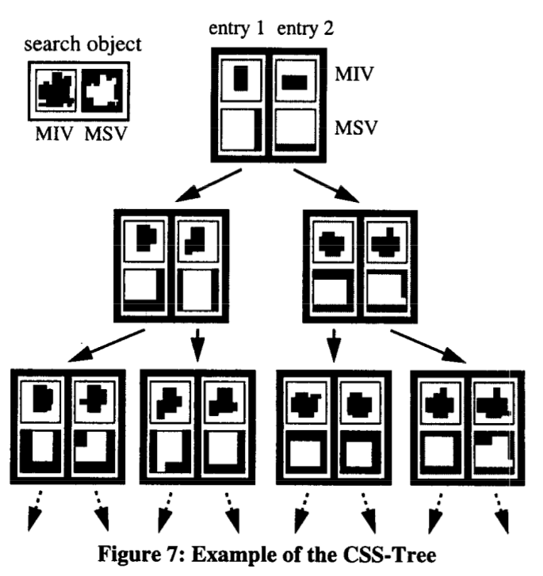

# Daniel A. Keim, Efficient Geometry-basedSimilarity Search of 3D Spatial Databases, SIGMOD 1999

## Intuition
* Use the Minimum Surrounding Volume (MSV) and Maximum Included Volume (MIV) to represent the real object in a compact way
* Construct a tree with finer resolution (volume) as the indexing structure

## Important figures

